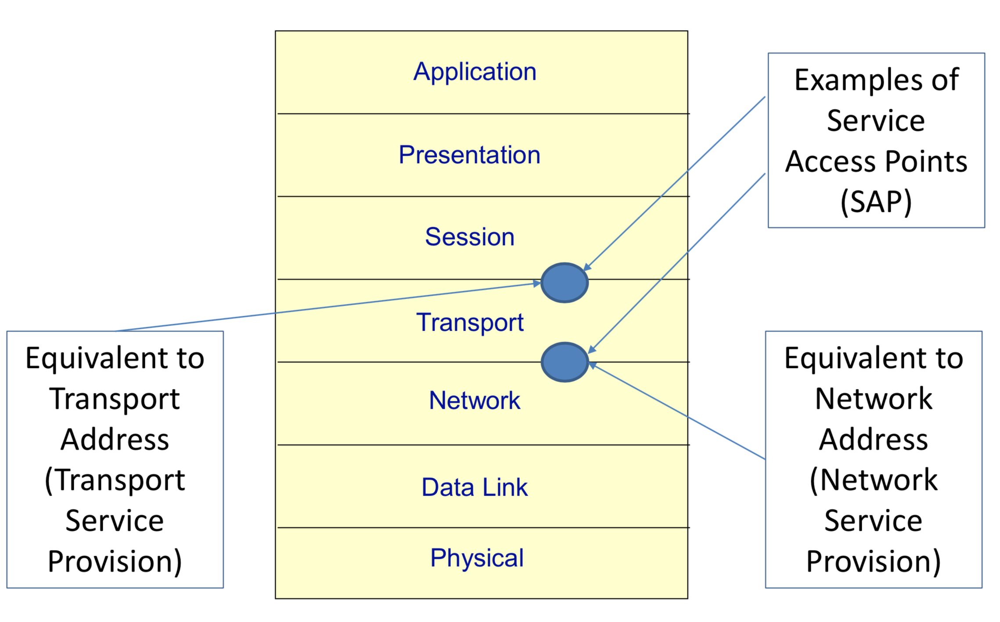
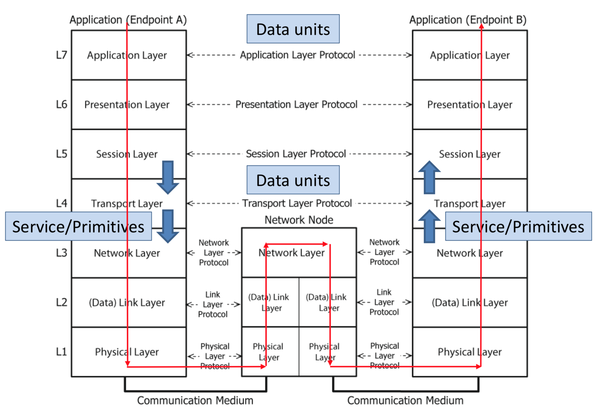
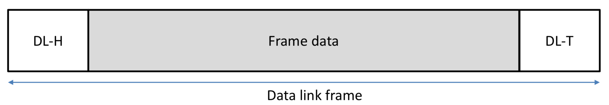
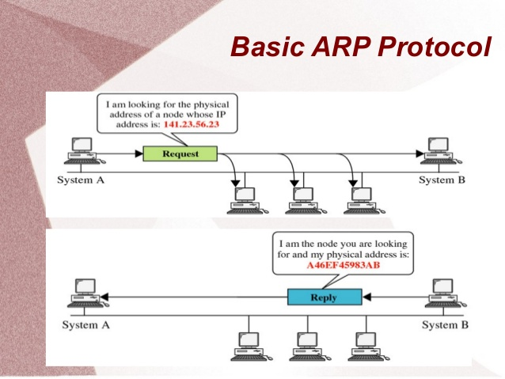

# Introducción

## App -> Network

<p align="center">
	
</p>

<p align="center">
	
</p>

Las líneas son estructuras de información.

En un tiempo determinado, el emisor envía unos datos con un protocolo HTTP a un receptor.

No solo se usan 2 protocolos. Se usan más.

HTTP que funciona sobre TCP, que funciona sobre un protocolo IP que funciona sobre un protocolo de datos.

<p align="center">
	
</p>

Podemos ver una cadena de datos que contiene los diferentes headers de todos los protocolos.

Primero: el protocolo DL (Data Link) que sería el de más bajo nivel. Luego el de IP (Internet Protocol). Seguido del TCP y finalmente el HTTP.

El protocolo IP es best-effort. IP no controla errores. Por lo tanto se creó una capa intermedia entre HTTP y IP, así TCP le da una capa de transporte entre ambos y añade seguridad a la red.

## OSI

El modelo OSI son 7 niveles:

#### Host
**NIVELES DE APLICACIÓN**
- Aplicación
- Presentación
- Sesión

**NIVELES DE TRANSPORTE**
- Transporte

#### La Red
- Red
- Data Link
- Físico

## Internet

El modelo de internet es (aprox.):

- Aplicación
- Transporte (TCP fiable ó UDP no fiable)
- IP
- Red (Data Link)
- Físico

<p align="center">
	
</p>

## Transmisión

## Estandarización
### OSI

Hay una comunicación entre niveles OSI (de la misma máquina, sería vertical) y una comunicación con otras máquinas, que sería horizontal, es decir, se comunican a través del mismo nivel.

<p align="center">
	
</p>

Siempre se ofrece hacía el nivel de arriba o desde el nivel de arriba.

<p align="center">
	
</p>

<p align="center">
	
</p>

> El router, (elemento central) tiene un solo nivel de red pero dos niveles de data link ya que cada una correspondería a la dirección donde quiero enviar la información.

Aunque en el cable solo se vea esto:

<p align="center">
	
</p>

Tenemos almacenada toda esta información:

<p align="center">
	
</p>

> Aunque los dibujos despisten, las cabeceras son pequeñas
>
> Cualquiera puede implementar un cliente HTTP o un servidor HTTP mientras se siga el protocolo.

IP es con conexión, se lo envío al otro y ya no sé nada más, no sé si ha llegado o no, etc.

TCP es con conexión, establezco un camino, antes de enviar nada de datos, establezco una conexión TCP entre el emisor y el destino y luego empiezo a enviar cosas.

Es decir, tengo una conexión virtual (TCP) y una conexión física entre las dos máquinas (por dónde pasarían los datos hasta llegar al destino). La comunicación virtual yo la controlo, la conexión física no.

**IP** --> best effort
**TCP** --> fiable
## Direcciones IP

**¿Cuántos bits usaremos para codificar las direcciones IP?**

Antes eran 32 bits (versión 4), luego 128 (versión 6)

[8 bits].[8 bits].[8 bits].[8 bits]

|0..255|0..255|0..255|0..255|
|-|-|-|-|

##### La dirección 10.1.1.0/24
- **10.1.1.0 Es la dirección de red + dirección de host**
- **24** son los bits (de los 32 que tiene) que **indican la dirección de la red** y los **8 restantes** (hasta 32) son los que **indican la dirección del host**.

#### Máscara de red

Para indicar máscara de subred en vez de poner (/24) también se puede expresar con una dirección, tal que en este caso sería **255.255.255.0** ya que si haces una `&` bit a bit entre `10.1.1.0 & 255.255.255.0` --> independientemente de lo que hubiese en los 8 bits del final, siempre se seleccionarían los 24 primeros.

#### Dirección de red

La dirección de host con todo ceros no se puede usar, ya que es equivalente a la de red. En nuestro caso 10.1.1.0 sería la dirección de red y no se puede usar como host. 10.1.1.56 SÍ. 10.1.1.0 NO.

#### Dirección de broadcast (acceder a todos)

Tampoco se puede usar la dirección de broadcast. Que sería con todo 1's. En nuestro caso 10.1.1.255. 10.1.1.47 SÍ. 10.1.1.255 NO.


#### Dirección del router

Tampoco se puede usar la dirección de router. Que dependiendo de la red será diferente.

#### Calcular número máximo de hosts

Sabiendo los bits de máscara de subred y quitandole las direcciones de red, broadcast y router, puedo calcular el número máximo de hosts posibles que puede haber en la red.

#### Routers

Los routers siempre tienen 2 o más direcciones IP. Ya que conectan siempre 2 o más redes. Tendrán una dirección IP por red.

### Direccionamiento

#### Direccionamiento público

Me permite acceder desde cualquier lugar. Es una dirección **única** mundialmente.

Las direcciones públicas son de pago.

#### Direccionamiento privado

Está en un rango prefijado y conocido por todo el mundo. Estas direcciones sí que **pueden estar repetidas**. Aunque haya más máquinas que direcciones, como hay repetidas, puede funcionar.

Sin embargo, una máquina no puede navegar por el mundo con una dirección privada. Por lo tanto, en el momento que quieras salir más allá de internet, tendrás que mapear (con un servicio de soporte) esa dirección privada a una pública.

Las direcciones privadas son "gratis".

#### Rangos de direcciones privadas

10.0.0.0 - 10.255.255.255

172.16.0.0 - 172.32.255.255

192.168.0.0 - 192.168.255.255

#### Clases de direcciones

Inicialmente las direcciones se organizan en clases:

|0|X|X|X|X|X|...|
|-|-|-|-|-|-|---|

- **CLASE A:** 8 bits para red, 24 bits para hosts
	- En realidad son 7 de red ya que siempre empiezan por 0 (para identificar que son de clase A).

|1|0|X|X|X|X|...|
|-|-|-|-|-|-|---|

- **CLASE B:** 16 bits para red, 16 bits para hosts
	- En realidad serían 14 bits de red ya que siempre empiezan por 1 y 0 (para identificar que son de clase B).

|1|1|0|X|X|X|...|
|-|-|-|-|-|-|---|
- **CLASE C:** 24 bits para red, 8 bits para hosts
	- En realidad serían 21 ya que siempre empiezan por 1, luego 1 y 0 (para identificar que son de clase C).

Hoy en día los números de bits de red y los números de bits son variables ya que internamente se racionan.

#### Ejemplo: Capacidad máxima con un rango 220.10.0.0/25

```
2 ^ (32 - 25) - 2 - Routers
```

```
Nº dir IP = Hosts + Routers + 2
```

Si son 53 direcciones, necesitaria 6 bits (64 direcciones). Es el número de bits lo suficientemente grande para que quepan.

El orden para empezar a repartir sería siempre empezar por el caso en el que tienes menos bits de máscara y por tanto más bits de host.

Si te sobran bits a la hora de repartir las direcciones de cada subred, o dejas más bits para añadir hosts o dejas más bits para añadir más redes.

There is no place like `127.0.0.1`.

`127.0.0.1` Es localhost.

### Enrutamiento

> PPP0 es una Point-To-Point connection. Dentro de ese PPP hay una subred con un rango de direcciones.

Me ayuda a decidir en qué dirección deben ir los datos. Yo le digo "a dónde quiero llegar" y la tabla te responde "Cómo ir y por dónde ir".

Para decirle "a dónde quiero llegar" tú le envías la dirección y la máscara de la subred a la que quieres llegar.

La tabla de enrutamiento te devuelve la "Gateway" y la "Interface".

> Para expresar el resto del mundo, se usa la dirección `0.0.0.0` con máscara `0.0.0.0`.

Gateway es la dirección a la que quiero ir y la Interface es "el cable por el que quiero pasar", e0, e1, ...
## IP (dudas)

> Interface es un nivel de hardware, por ejemplo, Ethernet.

### Cómo funciona el enrutamiento

No se hace a mano (aunque se puede hacer a mano, se puede programar). Pero lo normal es que haya mecanismos automáticos (que veremos en el tema 3).

Las tablas se actualizarán según unos algoritmos que veremos más tarde.

### Fragmentación

El nivel de transporte, para conectarse con otro nivel de transporte envía una información TCP o un datagrama. Y poco a poco luego, le va enviando paquetes de información en protocolo IP.

Para enviar cada paquete IP tienes que poner una cabecera. En esta cabecera está escondida información.

Si yo pido un vídeo, el servidor no me va enviar el vídeo entero, sino que me va devolviendo el vídeo a trozos.

> La cuestión es ¿de qué tamaño deben ser estos paquetes?

Eso lo determina transporte. Y le pasa esa información a IP. Que a su vez se lo envía al "hardware".

Cada protocolo admite un tamaño máximo de datos. El MTU es quien marca el tamaño del paquete.

> Cada subred puede tener MTU's diferentes, por eso, no puedes guardar un identificador de orden ya que si el MTU es más pequeño, tenemos un problema. Ya que al REFRAGMENTAR ¿qué identificador de orden le metes a cada uno de los paquetes (que están entre los ya numerados)?

> MTU: Maximmum Transfer Unit (datos + todos los headers)

Normalmente el tamaño es entre 1000 y 2000 bytes. Por lo tanto, IP tiene que fragmentar la información para poder enviarla.

Lo bueno es que estos datos fragmentados se pueden enviar de manera independiente. Sin embargo, la fragmentación es algo que intentamos evitar (es complejo).

Estos trozos que van a viajar de manera independiente por posibles rutas diferentes se reconstruyen en cada subred en la que viaja. Así cuando llega a la máquina de destino ya está construido.

Para que no se mezclen, tengo que tener un identificador del datagrama original. Y luego hago los trozos. Que cuando me lleguen sabré que son del mismo origen.

#### Orden

> Si tengo 20 bytes de cabecera y 1000 de datos, y la siguiente red tiene un MTU de 420. Fragmentaría la información en 2 de 20 + 400 y otro de 20 + 200.

Cada trozo tiene un identificador de orden que marca el número de desplazamiento (offset) respecto al principio del paquete.

Este offset está almacenado en un campo de la cabecera.

Para no dejarse ningún fragmento de los que me lleguen (yo sé el orden pero no sé cuando termina) guardo el tamaño del paquete entero en la cabecera.

> bit DF: Don't Fragment
> bit MF: More Fragments

¿Cómo sé yo que han llegado todos los paquetes (los grandes)? Tengo un bit en la cabecera que indica si faltan más fragmentos (MF: 1) o he terminado (MF: 0). Para reducir el nombre de bits del número de bytes, numero en bloques de 8 bytes.
#### ¿Cúantos bits necesito para el offset?

> La cabecera tiene un tamaño constante.

En concreto, para darle un identificador a cada uno de los octetos de los datos de un datagrama necesito 16 bits porque el máximo son 64KB.

Se decidió que el tamaño más pequeño de paquete son 8 bytes. Por tanto, me ahora 3 bits de la cabecera para poner el tamaño.

```
2^16 max / 2^3 min = 2^13 --> 13 bytes necesarios para poner el tamaño.
```

Por lo tanto, contamos en bloques de 8. Si tengo paquetes de 400 bytes, pondré 50 en el campo de tamaño.

Si el número no es múltiplo de 8, siempre intento alinear los datos de los paquetes a múltiplos de 8.

#### Campos de la cabecera

- Tamaño del paquete (13 bits)
- MF (bit de More Fragments)
- DF (bit Don't Fragment)
- Dirección de Origen (32 bits)
- Dirección de Destino (32 bits)

> Continuaremos con esto más tarde.

#### Siempre evitamos fragmentar

Para que transporte evite que IP fragmente (siempre es algo que intentamos evitar). Transporte trocea las cosas de manera lo suficientemente pequeña como para que viaje por todos los routers sin que IP tenga que fragmentar.

El problema es que transporte no sabe por donde va a viajar el datagrama. Por lo tanto, transporte no puede saber cuál es el tamaño mínimo para que salte por todas las subredes sin que IP tenga que fragmentar.

> Bit DF: Don't Fragment

Si al router al que le llega un datagrama con el bit de DF, y la única manera de llegar al destino es fragmentando. Se produce un error y el router lo envia de nuevo a origen, quien gestiona este error.

Hay un algoritmo llamado MTU Path Discovery puede calcular cual es el tamaño adecuado para fragmentar el datagrama.

#### [Cabecera IP](https://es.wikipedia.org/wiki/Cabecera_IP)

<p align="center">
	
</p>

> TTL (Time To Live): Todos los paquetes tienen un tiempo máximo de vida ya para evitar el overhead y para que desaparezca y no interfiera con Identificadores repetidos.

> IHL es un número múltiplo de 32 (mínimo las 5 filas obligatorias de la cabecera y máximo 11 filas más (16 filas)).

> [Protocolo](https://es.wikipedia.org/wiki/Anexo:Números_de_protocolo_IP): Son tipos de protocolo que viajan sobre IP sin ser parte de transporte.

> [Checksum](https://es.wikipedia.org/wiki/Cabecera_IP#Suma_de_Control_de_Cabecera:_16_bits): Control de errores.

> [Tipo de Servicio](https://es.wikipedia.org/wiki/Cabecera_IP#Tipo_de_Servicio:_8_bits): El octavo bit no se utiliza (solo se usan 7 bits). Los 3 primeros bits dan una señal de prioridad. Los 8 niveles de prioridad son bastante simbólicos ya que llega "el listillo" y le pone prioridad máxima a todo. Retardo. Rendimiento. Fiabilidad. Coste (ahora ya no se usa). Y al final el que no se usa.

### ¿Cuántas direcciones IP tenemos en un mm^2 de la tierra?

~600 millones.

> Es importante jaja no.

### IPv6

<p align="center">
	
</p>

# Protocolos de red

### [ARP](https://www.youtube.com/watch?v=xTOyZ6TWQdM)

> Siglas: Address Resolution Protocol

> ¿Qué hace? Resolver direcciones.
>
> Si quiero enviar un datagrama al mundo exterior tiene que pasar por el router. Yo sé la dirección IP del destino, pero también sabemos que el nivel IP se comunica con otra entidad a nivel IP a través de una conexión virtual (no hay una conexión física). Sino que se lo entrego (el datagrama) al nivel Data Link, el Data Link no tiene ni idea de qué es una dirección IP. Por lo tanto, tiene que haber una traducción de IP a Data Link. Pasar de dirección IP a dirección de enlace (Data Link). Eso es de lo que se encarga ARP.

> ¿Cómo averiguo yo la dirección de enlace de la máquina destino? Pues preguntando. La pregunta es: "¿Cuál es la dirección de enlace de la dirección IP destino X?". Se lo pregunto a todo el mundo (broadcast). Y alguien eventualmente me contestará. Por ejemplo, el router puede contestar, es esta. Y entonces ya puedo comunicarme con esa dirección de enlace.

<p align="center">
	
</p>  

> Para mejorar la eficiencia: Podemos tener una caché que se guarde las direcciones más recientes / usadas. Y así me puedo ahorrar la pregunta. Sin embargo, la dirección física y la dirección IP puede cambiar, y por tanto tengo un tiempo máximo que puedo permanecer sin refrescar la tabla / caché. Incluso yo puedo informar a los otros que he cambiado mi dirección IP y así "forzar" el refresco de sus tablas.

### ICMP

> Siglas: Internet Control Message Protocol

> ¿Qué hace? Preguntar (hacer solicitudes) o controlar errores. Por ejemplo, cuando da un error al fragmentar.
>

¿Qué mensajes transporta (de todos los request hay request y reply)?

- [Echo](https://es.wikipedia.org/wiki/Internet_Control_Message_Protocol#Echo_Reply) (para saber si una máquina está allí) como podría ser un ping.
- [Timestamp](https://es.wikipedia.org/wiki/Internet_Control_Message_Protocol#Timestamp) para sincronizar tiempos.

¿Qué errores hay?
- De servicios **(warnings)**:
	- Source quench (relantización)
	- [Redirect](https://es.wikipedia.org/wiki/Internet_Control_Message_Protocol#Redirecciones) (redirección)
- Informes **(errores)**:
	- [Destino inalcanzable](https://es.wikipedia.org/wiki/Internet_Control_Message_Protocol#Destino_de_Mensaje_Inalcanzable)
		- Red
		- Host
		- Protocolo
		- Port
	- [Tiempo excedido](https://es.wikipedia.org/wiki/Internet_Control_Message_Protocol#Tiempo_Excedido)

El formato de ICMP es variable. Es decir, cada mensaje tiene unos campos diferentes.

> ¿Cómo lo hace? Es un protocolo de red pero viaja sobre IP. Lo cual tiene sus problemas.

> Notas: Los errores de los mensajes de error no se reportan.
# Protocolos de red

### DHCP

> Siglas: Dynamic Host Configuration Protocol. Dinámico en este caso significa que es automático. Configuración es la configuración de host que necesita para interactuar en IP (dirección IP, nombre (asociado a un dominio DNS), gateway (router que te da acceso al exterior)).

> ¿Qué hace? Cuando arranco la máquina (normalmente), el servidor DHCP te da una configuración (dirección IP + nombre + gateway) para poder interactuar a través de IP.

- Dirección IP: es una dirección de subred.
- Máscara de la subred.
- Nombre: es un dominio de nombre que sigue una jerarquía.
- Gateway: te da acceso al exterior.
- Dirección del servidor DNS local.

> ¿Cómo lo hace? Yo lanzo un mensaje de broadcast preguntando por alguien que me pueda dar mi configuración y solamente el servidor DHCP me puede contestar.
>
> Cuando hago la pregunta, si hay más de dos servidores DHCP, cada uno lanza una propuesta y yo, el cliente, escojo la que quiera. Aunque normalmente solo tengo un servidor DHCP (normalmente el router). DHCP funciona sobre UDP, (no sobre IP, ni sobre transporte).
>
> Es sin conexión. Pero claro, ¿cómo hago yo el broadcast sin tener ni siquiera mi IP? Pongo todo a 1. Lo enviaré a la dirección de destino especial 255.255.255.255 y lo enviaré desde la dirección de origen 0.0.0.0. Todo esto en el discover.
>
> En el request, uso la dirección de destino que me ha venido en el offer.

> Notas: yo puedo tener más de un servidor DHCP.

#### Flujo de mensajes

**CLIENT <---> SERVIDOR**

1. DHCP discover --->

"Busco configuración. Escucho ofertas."

2. DHCP offer <---

"Aquí tienes mi oferta."

3. DHCP request --->

"Vale, acepto. Quiero esta oferta."

4. DHCP ack <---

"Aquí tienes tu configuración."

> También puede haber un No Ack que sería un "no te acepto".

### NAT

> Siglas: Network Address Translation. En realidad el NAT no es un protocolo, es un servicio.

> ¿Qué hace? El NAT resuelve el problema de traducir una dirección privada (dentro de una subred) a una dirección pública en el exterior de la subred.

> ¿Cómo lo hace? En el datagrama, el router intercambia la dirección de origen de privada (de la cabecera) y pone una dirección pública que tenga disponible (son de pago). Porque fuera de una subred yo no puedo tener una dirección privada, sólo públicas.

El router tiene una tabla en la que pone (ejemplo):

|Dirección privada|Dirección pública|
|-----------------|-----------------|
|10.0.10.3|200.200.0.100|

> Substituye la dirección privada por la pública y el receptor, cuando le llegue, devolverá el mensaje a la dirección pública. El router la recogerá y volverá a traducir la dirección (ahora pública) a la privada que tenía anteriormente. Y borrará la fila de la tabla.

##### NAPT / PAT

Network Address Port Translation
Port Address Translation

> Para aprovechar una dirección pública con varias direcciones privadas. Se usan... ports. Los ports de 0 a 1024 detectan el tipo de protocolo (o servicio que se quiere usar) el resto, los puedo usar para tener una sola dirección pública con varios ports, cada uno identificará a una sola dirección privada. El port está en la cabecera de transporte, no está en la cabecera de IP.

##### DNAT

Destination Network Address Translation

> El caso contrario, quiero dar varias direcciones públicas a una sola dirección privada.

### DNS

Traduce: **NOMBRE --> IP**

> Siglas: Domain Name System. En realidad es de nivel de aplicación aunque es el protocolo más básico para tener IP. DNS funciona sobre transporte, concretamente sobre UDP.

> ¿Qué hace? Es el protocolo según el cuál tú le das un nombre al servidor DNS y este te da una dirección IP. Nosotros identificamos las máquinas con nombres y DNS hace la traducción de esos nombres a su dirección IP.

Estos nombres tienen una jerarquía donde el último . algo es un top-level domain.
|myhost|.ac|.upc|.edu|
|-|-|-|-|

Hay organizaciones que reparten los dominios (por ejemplo upc.edu) y luego hay otras organizaciones que reparten los subdominios (por ejemplo ac.upc.edu). Todos estos dominios tienen que ser únicos.

> ¿Cómo lo hace? Antes de poder preguntar, tengo que tener una dirección DNS. Esta dirección te la da el servidor DHCP. La información IP de un nombre la tiene un servidor de nombres, quién tendrá una tabla con dos campos (nombre, dirección IP).
>
> Si yo quiero saber la dirección IP de un nombre, accedo a una máquina local. Dentro del dominio upc.edu habrá un servidor que tendrá las direcciones IP de cada uno de los servidores de nombres de cada departamento. Pero para saber la dirección del servidor de nombres upc.edu, tengo que preguntar al nivel superior. Es decir, voy accediendo jerárquicamente a cada uno de los servidores de nombres. Desde .edu, luego a upc.edu, luego a ac.upc.edu hasta llegar al host que quiero llegar.
>
> Obviamente, yo tengo una memoria caché en la que guardo las resoluciones de nombre recientes, así no tengo que estar pregutando contínuamente.
>
> Mi ordenador solamente pregunta al servidor de nombres local mío (dirección la cual te da el DHCP) y él se encarga de preguntar a los demás. A su vez, ese servidor local también tiene una gran caché para no tener que estar preguntando todo el rato.
# Routing Algorithms

Los routers se van preguntando entre ellos para tener información actualizada de sus enrutamientos.

> El objetivo es minimizar el número de saltos. Quiero que la ruta sea lo más rápido posible.

### Exterior (de frontera) vs Interior

Nosotros solo vamos a hablar de algoritmos interiores. Suponiendo que las subredes son iguales y que el criterio es único.

## [RIP](https://networkfaculty.com/es/video/detail/34-rip---introduccion): Routing Information Protocol

> Problema 2 del examen de 3/11/2016

#### RIP Update

Es un mensaje de actualización que se envía a todos los routers a los que está conectado. Se envían sobre UDP.

##### ¿Cada cuanto?

Solamente envío cuando hayan cambios (por ejemplo, si cae un router). Pero claro, si se muere un router, no podré saberlo, necesito saber que los routers siguen activos. Por tanto, se marca un tiempo mínimo para actualizar la información. Cada **30 segundos** recibo una actualización.

##### Si hace 31 segundos que no me dice nada. ¿Qué hago? ¿Cuánto espero?

Si me precipito, podría hacer un cambio brusco de enrutamiento innecesario. Por lo tanto, se esperan **180 segundos**. Si no recibo nada en 180 segundos, decido que está muerto (RIP router).

##### ¿Qué información se envía?

En la tabla de enrutamiento, yo guardo: `el destino, el gateway, el interface y la métrica` (es el número de **saltos / aristas** que necesito para llegar a la máquina de destino).

La información que se envía es lo que el router sabe (un vector de distancias / saltos).

> Si el router es adyacente a una subred, el número de saltos es 1.

Se intenta **minimizar la cantidad de saltos**.
### Split Horizon

> No devuelven la información que se le ha dado por el mismo interfaz.

### Poisoned Reverse

> Enviar un infinito para decir: "hey, no me envies nada de esta dirección por aquí."

El infinito se programa con un 16.

## Open Shortest Path First (OSPF)

En este algoritmo, se envía un mapa de todo lo que te me han contado. Voy más allá de sólo saltos, envío más información sobre mis alrededores.

- Se transmite sobre IP.
- Se distribuye usando `flooding`.
- Sólo se envían mensajes cuando ocurre algún cambio. A no ser que me pidas un update.
- Se usan dos protocolos:
	- Protocolo `hello`
	- Protocolo para enviar información de estado.
- Se envían muchas métricas (es más sofisticado).

## Classless Inter-Domain Routing (CIDR)

#### Conceptos

#### Classless

No tiene en cuenta las clases de las direcciones IP.

##### Agregar

Agregar entradas en la tabla de enrutamiento en tablas de routing

> Si yo tengo:

- 200.200.0.0 / 24	->	Rx
- 200.200.1.0 / 24	->	Rx

> Si las uno **(AGREGACIÓN)**, Podría hacer:

- 200.200.0.0 / 23	->	Rx

Y me ahorro una entrada / fila en la tabla de páginas.

##### Sumarizar

Sumarizar es agregar en la misma clase. Pero como estamos hablando de **classless** siempre hablaremos de agregación.
## Seguridad

Los servicios pueden ser:
- Preventivos
-
-

#### Mecanismos en nivel de IP

- Firewalls

> Reciben un datagrama y deciden si puede pasar o no puede pasar. Normalmente se implementa en el router. Los campos de la cabecera IP nos sirven como filtro.

> 20/01/2016 Problema 1 Apartado F

> 03/11/2016 Problema 1 (creo) Apartado F

- VPN (Virtual Private Networks)

> Si yo tengo dos subredes que no están juntas, pero yo quiero que estén juntas conectadas. Al estar lejos, es complicado unirlas físicamente. Por lo tanto, para hacer que pueda ver la subred que está superlejos, uso un **VPN tunnel** para poder mandarlo directamente por allí.

> ¿Cómo lo hago? Escondo mi datagrama dentro de otro datagrama (como si fuera un camión). Incluso en el datagrama interior yo puedo poner una dirección privada.
// Nada importante
## UDP (User Datagram Protocol)

> UDP añade una cabecera.

Aplicación --> UDP (quien añade una cabecera) --> IP

Lo que añade en la cabecera es:
- Source Port: dirección de puerto de origen (16 bits)
- Destination Port: dirección de puerto de destino (16 bits)
- Length (16 bits)
- Checksum: de la cabecera y también parte del cuerpo y también parte de la dirección IP (16 bits)

> De puerto significa simplemente una dirección de transporte (que identifica una dirección de aplicación).

> TO-DO: complementar con las transparencias pero tampoco hace falta entrar en más detalle.

> Usaré cuando IP no pueda fallar --> IP nunca falla cuando solo actúo en mi red.

> Si envío un archivo grande no me sirve UDP (porque no controla errores).

## ARQ (Automatic Repeat reQuest)

Automaticamente se repite la transmisión si no se recibe una confirmación de recibido (ACK).

- **Tiempo de proceso**: son los tiempos de CPU. (son despreciables, por lo tanto tiende a 0)
- **Tiempo de propagación (tp)**: depende del medio y la distancia. (más o menos, la velocidad de la luz, si hay muy poca distancia, puede llegar a ser despreciable)
- **Tiempo de transmisión de datos (tt)**: depende de la cantidad de datos.
- **Tiempo de transmisión de ACKs (ta)**: normalmente es menor que el tiempo de transmisión de datos. Tiene la misma velocidad que la velocidad de transimisión de datos.
- **Tiempo de espera (tout)**: temporizador, es calculado por el software. RTO (Retransmission TimeOut)

> RTT (Round Trip Time): Es el tiempo que tarda en transmitir + recibir + ACK + recibir ACK.

## Protocolos

### Stop & Wait (S & W)

Envío paquete, espero ACK. Recibo el ACK.
Envío paquete, espero ACK, si no me llega, retransmito paquete.

### Transferencia continua

No me espero a que me llegue el ACK.

##### Go back N

Descarta desordenados.

##### Retransmisión selectiva

Toca reordenar.

## TCP (Transmission Control Protocol)

> Los ACKs son acumulados (significa "han llegado todos los anteriores") (se descartan duplicados).

> + transparencias página 9 (go back n / selective retransmission) hasta la página 14 (eficiencia con errores)
