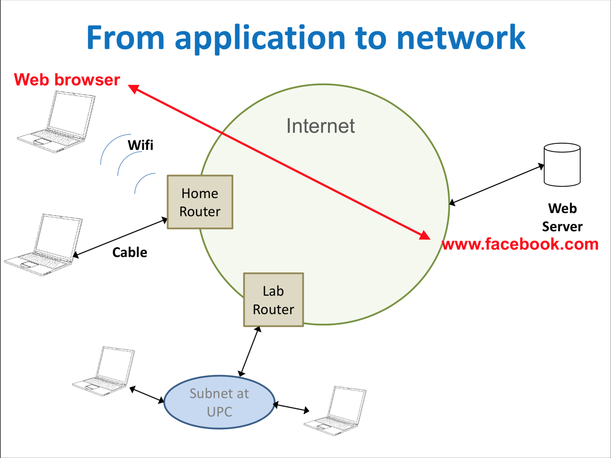
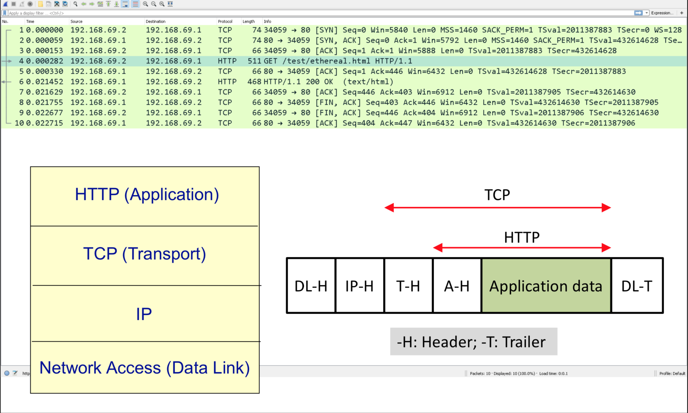
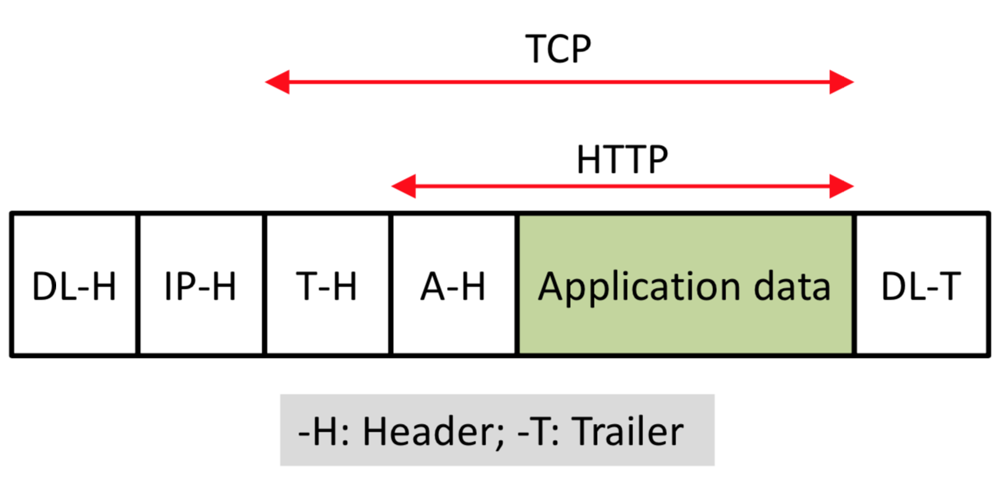
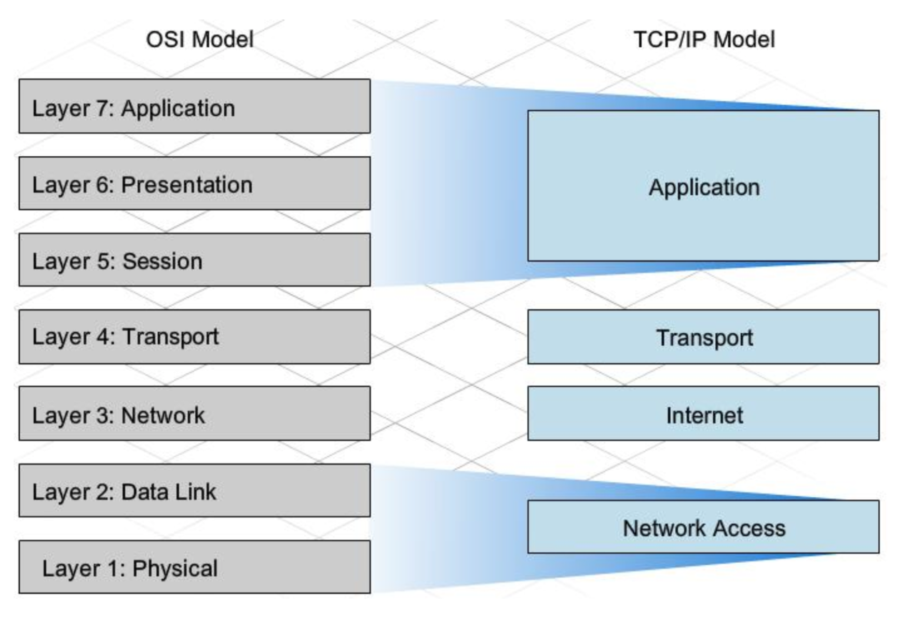

# Introducción

## App -> Network

Las líneas son estructuras de información.

En un tiempo determinado, el emisor envía unos datos con un protocolo HTTP a un receptor.

No solo se usan 2 protocolos. Se usan más.

HTTP que funciona sobre TCP, que funciona sobre un protocolo IP que funciona sobre un protocolo de datos.

Podemos ver una cadena de datos que contiene los diferentes headers de todos los protocolos.

Primero: el protocolo DL (Data Link) que sería el de más bajo nivel. Luego el de IP (Internet Protocol). Seguido del TCP y finalmente el HTTP.

El protocolo IP es best-effort. IP no controla errores. Por lo tanto se creó una capa intermedia entre HTTP y IP, así TCP le da una capa de transporte entre ambos y añade seguridad a la red.

## OSI

El modelo OSI son 7 niveles:

#### Host
**NIVELES DE APLICACIÓN**
- Aplicación
- Presentación
- Sesión

**NIVELES DE TRANSPORTE**
- Transporte

#### La Red
- Red
- Data Link
- Físico

## Internet

El modelo de internet es (aprox.):

- Aplicación
- Transporte (TCP fiable ó UDP no fiable)
- IP
- Red (Data Link)
- Físico

## Transmisión

## Estandarización
