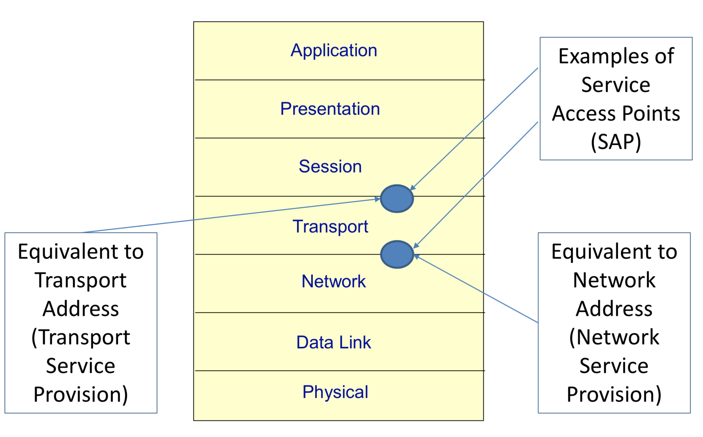
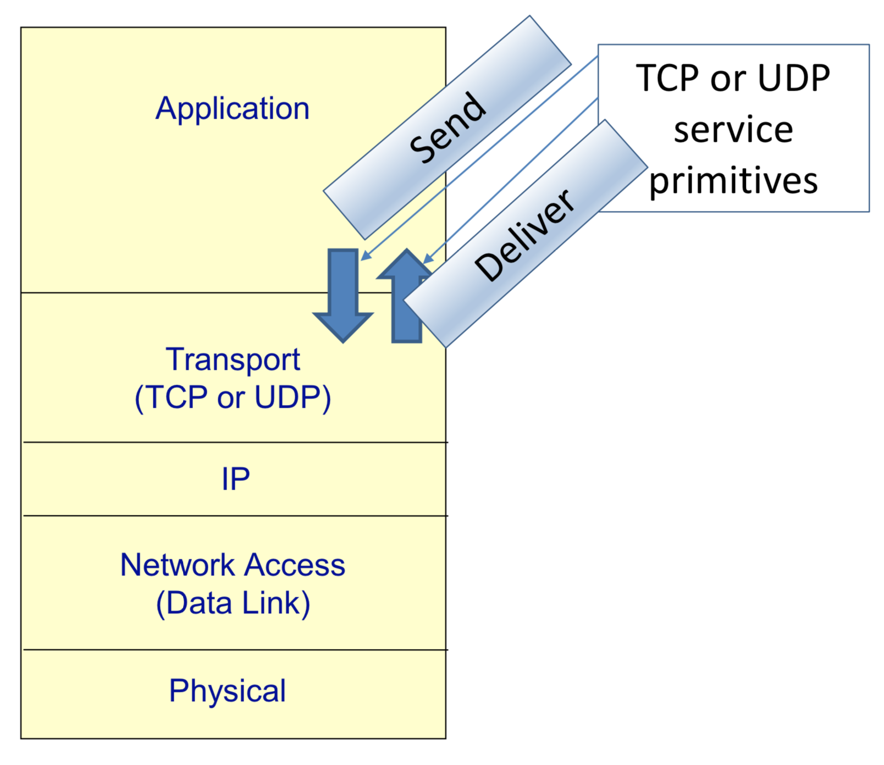
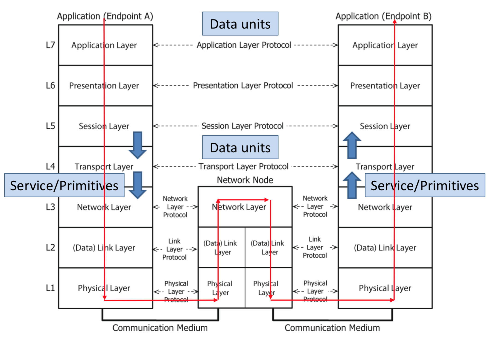
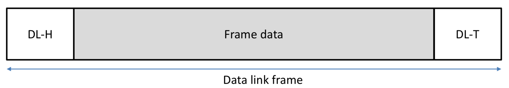
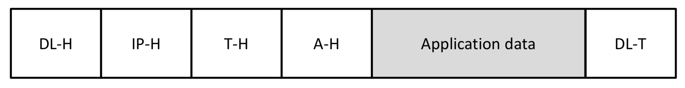

### OSI

Hay una comunicación entre niveles OSI (de la misma máquina, sería vertical) y una comunicación con otras máquinas, que sería horizontal, es decir, se comunican a través del mismo nivel.

	

Siempre se ofrece hacía el nivel de arriba o desde el nivel de arriba.

	

	

> El router, (elemento central) tiene un solo nivel de red pero dos niveles de data link ya que cada una correspondería a la dirección donde quiero enviar la información.

Aunque en el cable solo se vea esto:

	

Tenemos almacenada toda esta información:

	

> Aunque los dibujos despisten, las cabeceras son pequeñas
>
> Cualquiera puede implementar un cliente HTTP o un servidor HTTP mientras se siga el protocolo.

IP es con conexión, se lo envío al otro y ya no sé nada más, no sé si ha llegado o no, etc.

TCP es con conexión, establezco un camino, antes de enviar nada de datos, establezco una conexión TCP entre el emisor y el destino y luego empiezo a enviar cosas.

Es decir, tengo una conexión virtual (TCP) y una conexión física entre las dos máquinas (por dónde pasarían los datos hasta llegar al destino). La comunicación virtual yo la controlo, la conexión física no.

**IP** --> best effort
**TCP** --> fiable
