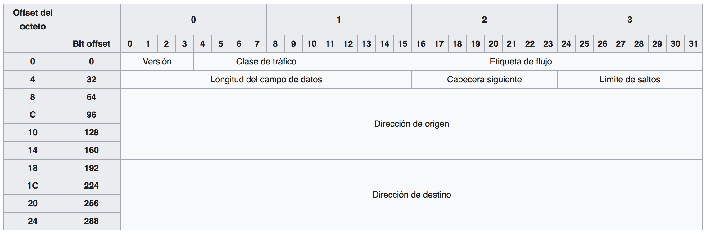
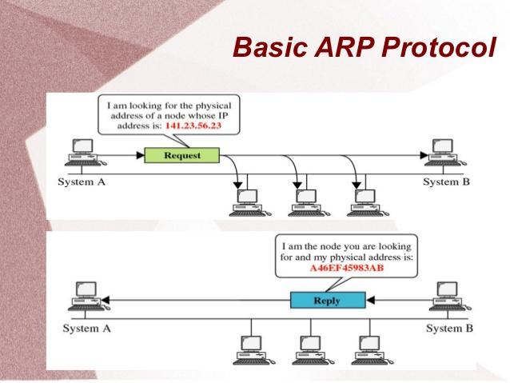

#### ¿Cúantos bits necesito para el offset?

> La cabecera tiene un tamaño constante.

En concreto, para darle un identificador a cada uno de los octetos de los datos de un datagrama necesito 16 bits porque el máximo son 64KB.

Se decidió que el tamaño más pequeño de paquete son 8 bytes. Por tanto, me ahora 3 bits de la cabecera para poner el tamaño.

```
2^16 max / 2^3 min = 2^13 --> 13 bytes necesarios para poner el tamaño.
```

Por lo tanto, contamos en bloques de 8. Si tengo paquetes de 400 bytes, pondré 50 en el campo de tamaño.

Si el número no es múltiplo de 8, siempre intento alinear los datos de los paquetes a múltiplos de 8.

#### Campos de la cabecera

- Tamaño del paquete (13 bits)
- MF (bit de More Fragments)
- DF (bit Don't Fragment)
- Dirección de Origen (32 bits)
- Dirección de Destino (32 bits)

> Continuaremos con esto más tarde.

#### Siempre evitamos fragmentar

Para que transporte evite que IP fragmente (siempre es algo que intentamos evitar). Transporte trocea las cosas de manera lo suficientemente pequeña como para que viaje por todos los routers sin que IP tenga que fragmentar.

El problema es que transporte no sabe por donde va a viajar el datagrama. Por lo tanto, transporte no puede saber cuál es el tamaño mínimo para que salte por todas las subredes sin que IP tenga que fragmentar.

> Bit DF: Don't Fragment

Si al router al que le llega un datagrama con el bit de DF, y la única manera de llegar al destino es fragmentando. Se produce un error y el router lo envia de nuevo a origen, quien gestiona este error.

Hay un algoritmo llamado MTU Path Discovery puede calcular cual es el tamaño adecuado para fragmentar el datagrama.

#### [Cabecera IP](https://es.wikipedia.org/wiki/Cabecera_IP)

<p align="center">
	
</p>

> TTL (Time To Live): Todos los paquetes tienen un tiempo máximo de vida ya para evitar el overhead y para que desaparezca y no interfiera con Identificadores repetidos.

> IHL es un número múltiplo de 32 (mínimo las 5 filas obligatorias de la cabecera y máximo 11 filas más (16 filas)).

> [Protocolo](https://es.wikipedia.org/wiki/Anexo:Números_de_protocolo_IP): Son tipos de protocolo que viajan sobre IP sin ser parte de transporte.

> [Checksum](https://es.wikipedia.org/wiki/Cabecera_IP#Suma_de_Control_de_Cabecera:_16_bits): Control de errores.

> [Tipo de Servicio](https://es.wikipedia.org/wiki/Cabecera_IP#Tipo_de_Servicio:_8_bits): El octavo bit no se utiliza (solo se usan 7 bits). Los 3 primeros bits dan una señal de prioridad. Los 8 niveles de prioridad son bastante simbólicos ya que llega "el listillo" y le pone prioridad máxima a todo. Retardo. Rendimiento. Fiabilidad. Coste (ahora ya no se usa). Y al final el que no se usa.

### ¿Cuántas direcciones IP tenemos en un mm^2 de la tierra?

~600 millones.

> Es importante jaja no.

### IPv6

<p align="center">
	
</p>

# Protocolos de red

### [ARP](https://www.youtube.com/watch?v=xTOyZ6TWQdM)

> Siglas: Address Resolution Protocol

> ¿Qué hace? Resolver direcciones.
>
> Si quiero enviar un datagrama al mundo exterior tiene que pasar por el router. Yo sé la dirección IP del destino, pero también sabemos que el nivel IP se comunica con otra entidad a nivel IP a través de una conexión virtual (no hay una conexión física). Sino que se lo entrego (el datagrama) al nivel Data Link, el Data Link no tiene ni idea de qué es una dirección IP. Por lo tanto, tiene que haber una traducción de IP a Data Link. Pasar de dirección IP a dirección de enlace (Data Link). Eso es de lo que se encarga ARP.

> ¿Cómo averiguo yo la dirección de enlace de la máquina destino? Pues preguntando. La pregunta es: "¿Cuál es la dirección de enlace de la dirección IP destino X?". Se lo pregunto a todo el mundo (broadcast). Y alguien eventualmente me contestará. Por ejemplo, el router puede contestar, es esta. Y entonces ya puedo comunicarme con esa dirección de enlace.

<p align="center">
	
</p>  

> Para mejorar la eficiencia: Podemos tener una caché que se guarde las direcciones más recientes / usadas. Y así me puedo ahorrar la pregunta. Sin embargo, la dirección física y la dirección IP puede cambiar, y por tanto tengo un tiempo máximo que puedo permanecer sin refrescar la tabla / caché. Incluso yo puedo informar a los otros que he cambiado mi dirección IP y así "forzar" el refresco de sus tablas.

### ICMP

> Siglas: Internet Control Message Protocol

> ¿Qué hace? Preguntar (hacer solicitudes) o controlar errores. Por ejemplo, cuando da un error al fragmentar.
>

¿Qué mensajes transporta (de todos los request hay request y reply)?

- [Echo](https://es.wikipedia.org/wiki/Internet_Control_Message_Protocol#Echo_Reply) (para saber si una máquina está allí) como podría ser un ping.
- [Timestamp](https://es.wikipedia.org/wiki/Internet_Control_Message_Protocol#Timestamp) para sincronizar tiempos.

¿Qué errores hay?
- De servicios **(warnings)**:
	- Source quench (relantización)
	- [Redirect](https://es.wikipedia.org/wiki/Internet_Control_Message_Protocol#Redirecciones) (redirección)
- Informes **(errores)**:
	- [Destino inalcanzable](https://es.wikipedia.org/wiki/Internet_Control_Message_Protocol#Destino_de_Mensaje_Inalcanzable)
		- Red
		- Host
		- Protocolo
		- Port
	- [Tiempo excedido](https://es.wikipedia.org/wiki/Internet_Control_Message_Protocol#Tiempo_Excedido)

El formato de ICMP es variable. Es decir, cada mensaje tiene unos campos diferentes.

> ¿Cómo lo hace? Es un protocolo de red pero viaja sobre IP. Lo cual tiene sus problemas.

> Notas: Los errores de los mensaje de error no se reportan.

### DHCP

> Siglas: Dynamic Host Configuration Protocol

> ¿Qué hace?

> ¿Cómo lo hace?

### NAT

> Siglas: Network

> ¿Qué hace?

> ¿Cómo lo hace?

### DNS

> Siglas:

> ¿Qué hace?

> ¿Cómo lo hace?
