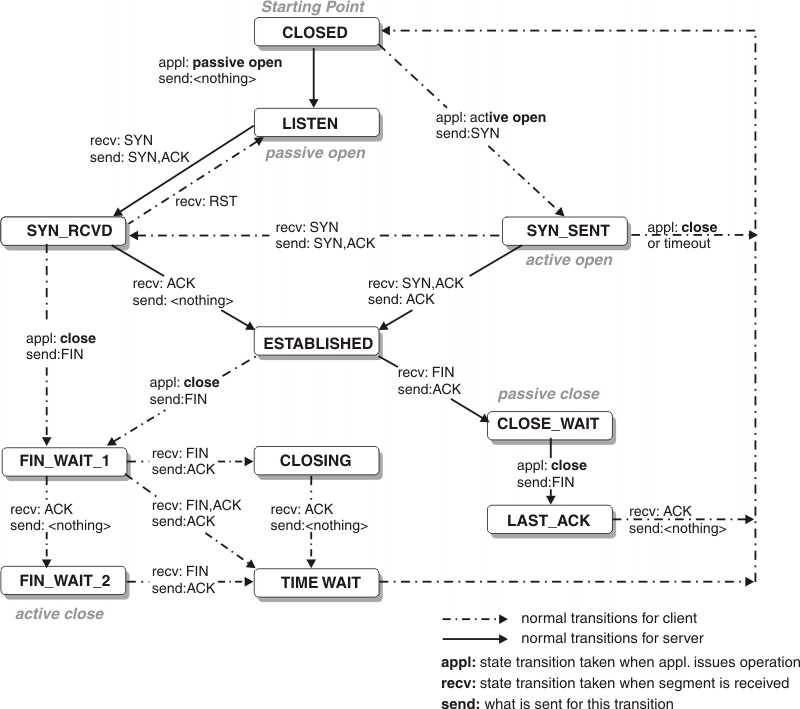
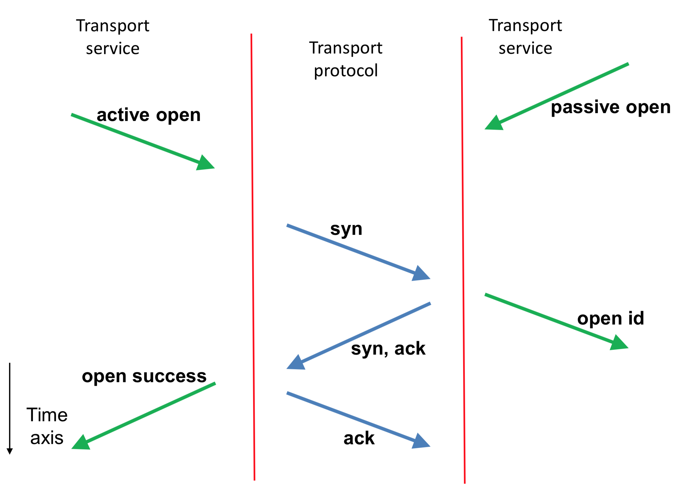
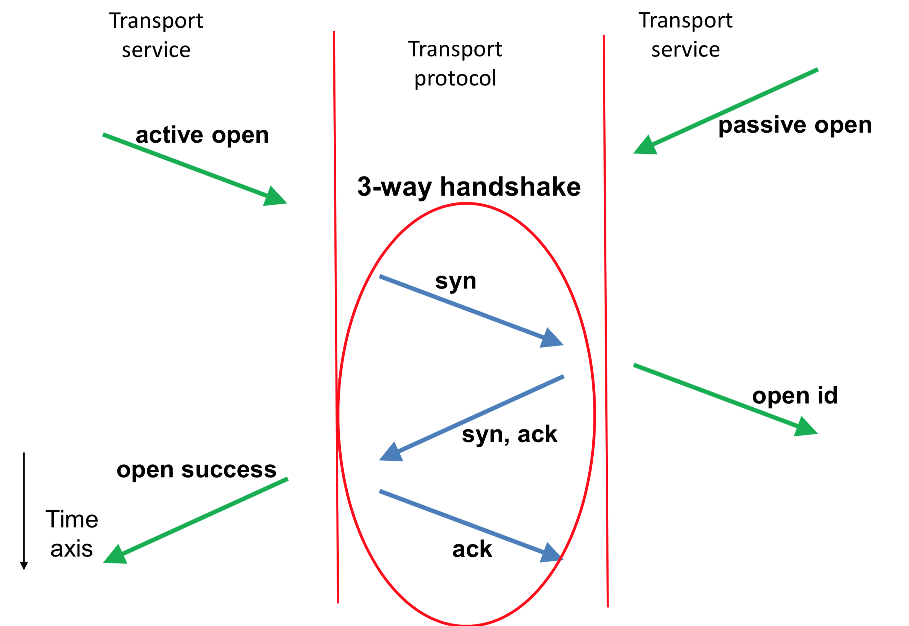
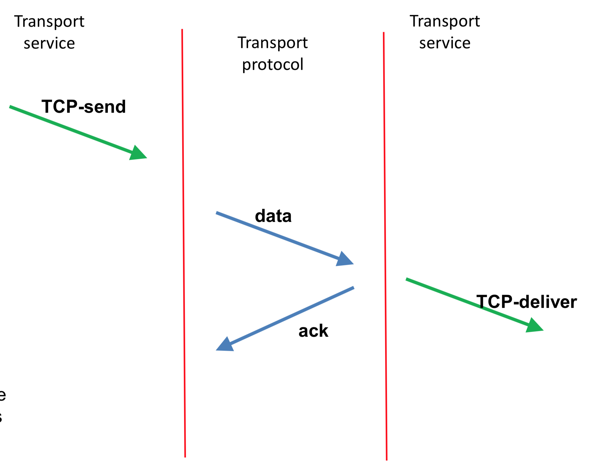
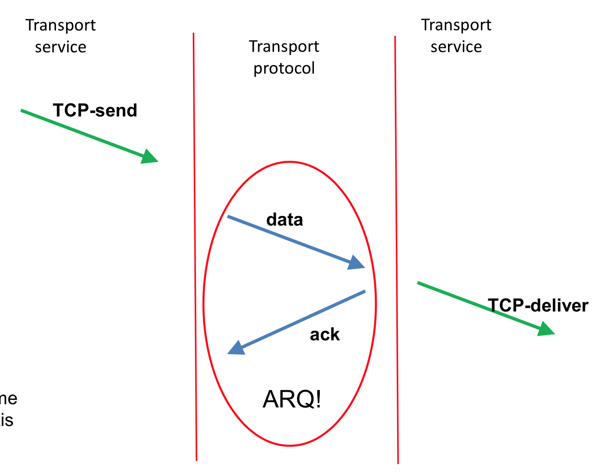
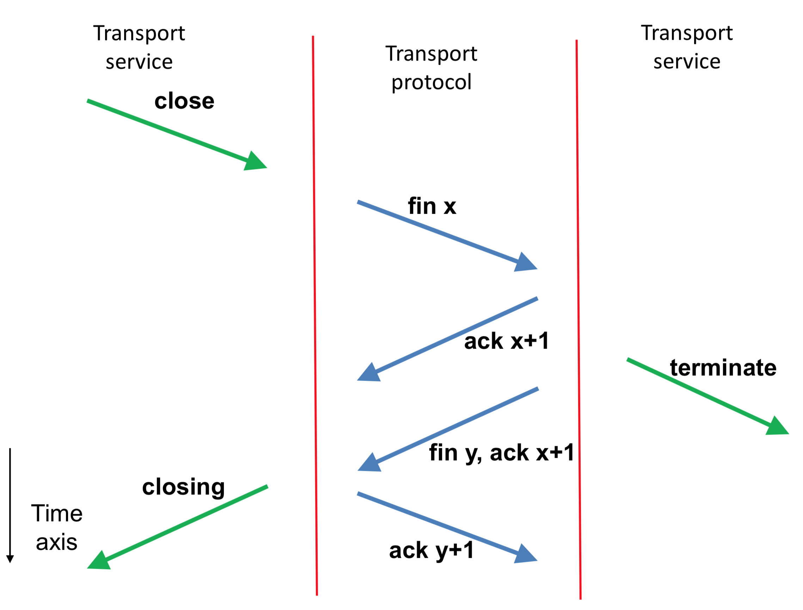
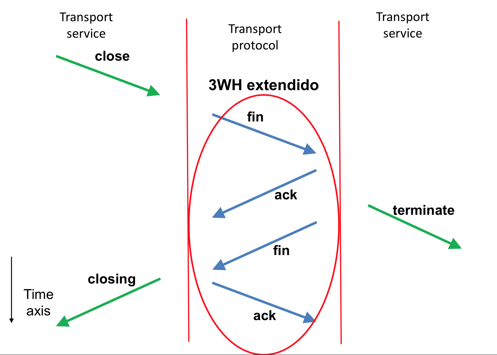
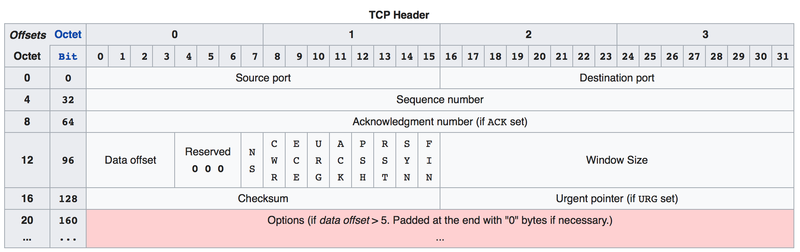
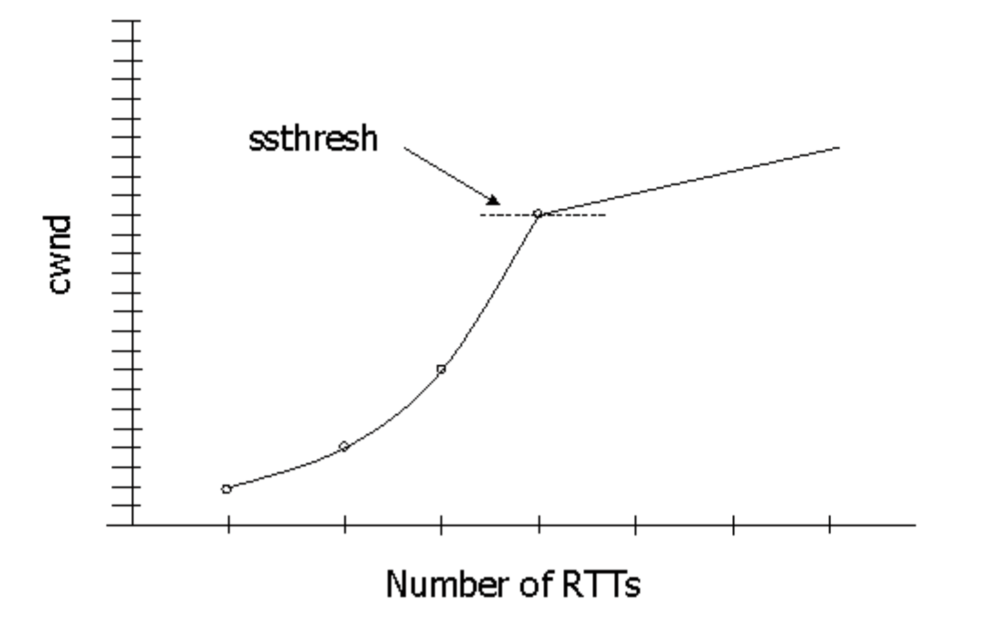

## TCP (Transmission Control Protocol)

El TCP tiene un tiempo de ciclo extremadamente variable. Es decir, el valor no es fijo y por tanto tiene que usar otros mecanismos para mejorar su eficiencia.

<p align="center">
	
</p>

### Establecimiento de la conexión (conexión)

El PDU (Protocol Data Unit) del TCP son **segmentos**.

Un servidor TCP lee la cabecera de TCP y lo transmite hacia donde sea necesario.

<p align="center">
	
</p>

> El cliente siempre inicia la conexión.

<p align="center">
	
</p>

### Transferencia de datos (transmisión)

<p align="center">
	
</p>


<p align="center">
	
</p>

### Liberación de la conexión (desconexión)

<p align="center">
	
</p>

> El momento de desconexión de ambos servidores no es el mismo. Entre `ack x+1` y `fin y, ack x+1` pueden pasar muchas cosas (pueden seguirse enviando datos).

<p align="center">
	
</p>

## TCP - Conceptos

> Los puertos < 1024 --> puertos reservados.

> Los puertos >= 1024 --> puertos de libre uso (clientes).

> En TCP se envían octetos, no van de 1 en 1 los segmentos. En los anteriores, van de 1 en 1.

> (ISN) El número de secuencia no empieza por 0. Cada conexion TCP empieza con un número aleatorio.

## [TCP - Header](https://en.wikipedia.org/wiki/Transmission_Control_Protocol#TCP_segment_structure)

<p align="center">
	
</p>

> Si yo envío el segmento 300. Recibo el ACK 301.

> Window size indica la cantidad de paquetes que puede procesar el receptor, con el objetivo de que el emisor y el receptor tengan el mismo flujo de trabajo. No se puede enviar más de esos bytes por round trip time. ¿Cómo se implementa? Cada servidor anuncia su window size al otro. Es decir, la primera vez, el emisor le envía su window size al receptor y luego el receptor le envía su window size al emisor. Así repetidamente con cada segmento que se envía.

> Data offset = header length

> Flags:
>
> - SYN (iniciar)
> - ACK (confirma, casi siempre está a 1 menos en la conexión inicial.)
> - FIN (acabar)
> - URG (urgent pointer es válido)
> - RST (reset)
> - PSH (se activa cuando un segmento transporte los últimos octetos de la aplicación: "Asks to push the buffered data to the receiving application.")

> MTU (Maximum Transfer Unit) > MSS (Maximum Segment Size) ya que la cabecera de TCP + datos van dentro de los datos de IP. (IPH + TCPH + Data)

> Urgent pointer: indica el primer trozo de datos a procesar. (si hago Ctrl + C no tiene sentido que procese todos los datos anteriores)

> Hay diferentes opciones:
>
> - MSS, SACK y Timestamp solamente para el inicio de la conexión (SYN).

## Temporizadores

#### Envío

- **Retransmisión**: Segmento no confirmado
- **Persistencia**: Abortar la conexión si no hay ACKs.

#### Recepción

- **Ventana**: Tiempo máximo entre envíos ACK.
- **Inactividad**: Abortar conexión cuando no hay datos.

#### Especiales

- **Reconexión**: Tiempo mínimo entre conexiones "correctas" (con la misma dirección de destino)
- **Retransmisión de conexión**: Tiempo mínimo entre intentos de establecimiento de conexión (retransmisión de SYNs).

## Control de congestión

```py
Vc = 1 * MSS
umbral = infinito

while True:
	for ack in new_acks:
		if Vc < umbral:
			# [Fase SS] [MSS: Maximum Segment Size]
			Vc = Vc + MSS
		else:
			# [Fase CA] [En MSSs: Vc:=Vc+(1/Vc)]
			# (Vc incrementa en 1 cuando recibe Vc octetos)
			Vc = Vc + MSS * MSS/Vc

	if timeout:
		# Se retransmite el segmento que no ha recibido ACK
		umbral := max(min(Va, Vc) / 2, 2 * MSS);
		Vc := 1 MSS;
```

<p align="center">
	
</p>
