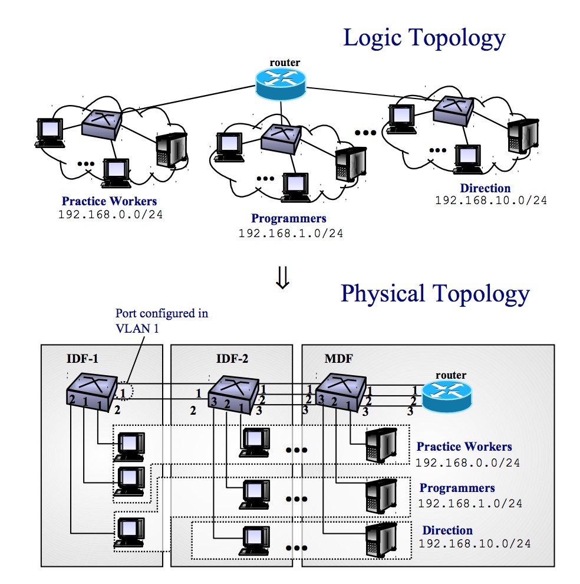
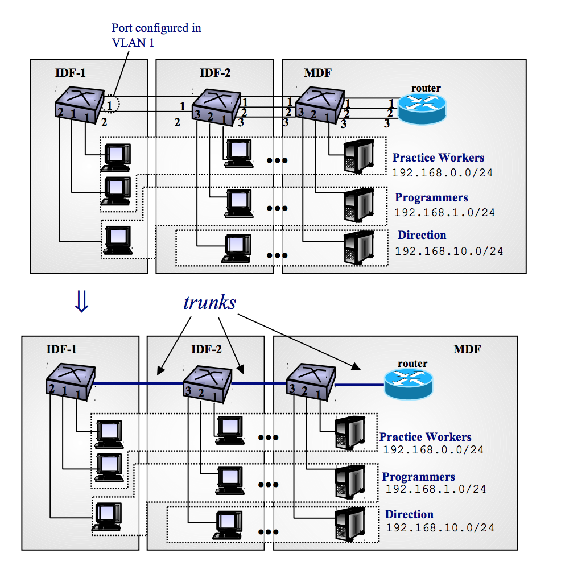

## LANs

> En los modelos antiguos de LAN, cuesta lo mismo un unicast que un broadcast ya que hay que inundar la red igualmente.

Hoy en día, tenemos un switch (un commutador de tramas ethernet), así puedo hacer más interacciones entre los PCs de la red sin que haya interferencias.

Cuando envías tramas a un destinatario esperas un ACK pero uno para antes de llenar el buffer del router para evitar desbordamientos. Por eso los envios de tramas van a picos.

> Para entender como funciona la gestión de tramas del router: [Leaky Bucket](https://es.wikipedia.org/wiki/Algoritmo_de_cubeta_con_goteo)

Cuando lo almacenas en la ram (los datagramas que no se pueden enviar directamente) estás aumentando la latencia (haciendo como si el emisor y el receptor estuviesen más lejos).

Por lo tanto, es mejor perder algun que otro paquete para evitar que guardarlos todos ya que la latencia aumentará mucho.

### VLANs

Una VLAN consigue separar una misma red con un ID (identificador) de VLAN por lo tanto, cuando haga un broadcast (255.255.255.255) nunca lo recibirán aquellas partes que tienen un identificador de VLAN diferente.

	

##### Cómo se organizan varias redes VLAN?

En una trama Ethernet puedo poner el identificador VLAN. Por lo tanto, yo solo recibiré aquellos paquetes que coincidan con mi identificador de VLAN.

Las tramas tienen color (los identificador de VLAN se pueden entender como colores). De esos colores yo puedo:
- Solo coger aquellos datagramas que tengan el mismo identificador.
- Organizar los

> En vez de usar el ID yo puedo "definir" un puerto para un identificador y un puerto para el otro. Por lo tanto, los rojos se verán en el rojo y los amarillos veran los datagramas amarillos. ¿Pero qué pasa si yo quiero enviar algo a un rojo siendo amarillo? Usando el modo [trunk](https://en.wikipedia.org/wiki/Trunking#VLAN).

	

